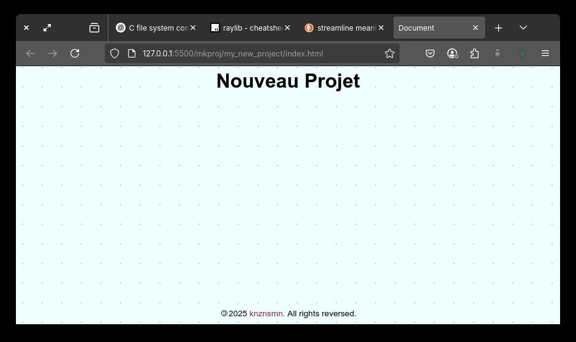

# mkproj Script

mkproj is a command-line script I wrote to streamline code practice. I prefer to place the compiled binary to the `bin` directory.

```bash
~/.local/bin/
```

This way, I can call the script:

```bash
mkproj my_new_project
```

This command creates a directory named `my_new_project`, and contains the most common files I need when starting a project.

```
/my_new_project
--index.html
--/css
----style.css
--/js
----main.js
----/modules
------utils.js
--/assets
----/imgs
----/icons
----/fonts
```

It only creates HTML/CSS/JS starting directories and files for now.

The created files contain basic codes. I'm too lazy, that's why I'm learning to code.

## Screenshot


### index.html

```html
<!DOCTYPE html>
<html lang="en">
<head>
  <meta charset="UTF-8">
  <meta name="viewport" content="width=device-width, initial-scale=1.0">
  <title>Document</title>
  <link rel="stylesheet" href="./css/style.css">
</head>
<body>
  <header>
    <h1>Nouveau Projet</h1>
  </header>
  <main>

  </main>
  <footer>
    <p>
      <span id="ans"></span>
      <a href="https://www.github.com/knznsmn">knznsmn.</a> All rights reversed.
    </p>
  </footer>
  <script type="module" src="./js/main.js"></script>
</body>
</html>

```

### style.css

The stylesheet contains the reset styling so I don't have to start from scratch everytime.
```css
/* Global resets */

*, *::before, *::after {
  box-sizing: border-box;
}

* {
  margin: 0;
}

body {
  line-height: 1.5;
  -webkit-font-smoothing: antialiased;
}

img, picture, video, canvas, svg {
  display: block;
  max-width: 100%;
}

input, button, textarea, select {
  font: inherit;
}

p, h1, h2, h3, h4, h5, h6 {
  overflow-wrap: break-word;
}

p {
  text-wrap: pretty;
}
h1, h2, h3, h4, h5, h6 {
  text-wrap: balance;
}
#root, #__next {
  isolation: isolate;
}

/* General Styling */

:root {
	/* Hues */
	--hue-main: rgb(137, 42, 42); 
}

body {
	width: 100vw;
	min-height: 100vh;
	display: flex;
	flex-direction: column;
	font-family: Arial, Helvetica, sans-serif;
	font-size: 16px;
	--bgh: rgb(238, 255, 253);
  --hue: rgb(200, 202, 202);
  --box: .1rem;
  --spc: 2rem;
	background:
		linear-gradient(90deg,
		var(--bgh) calc(var(--spc) - var(--box)),
		transparent 1%) center / var(--spc) var(--spc),
		linear-gradient(var(--bgh) calc(var(--spc) - var(--box)),
		transparent 1%) center / var(--spc) var(--spc),
		var(--hue);
}
a {
	text-decoration: none;
}

a:link {
	color: var(--hue-main);
}

a:visited {
	color:aquamarine;
}

a:focus {
	filter: invert(1);
}

a:hover {
	filter: invert(1);
}

a:active {
	filter: invert(.5);
}

header {
	text-align: center;
}
main {
	flex: 1;
}
footer {
	text-align: center;
	font-size: .85rem;
}
footer span::before {
	display: inline-block;
	content: '\00A9';
	transform: rotate(180deg);
	margin: 0 .15rem .5rem;
}
```

